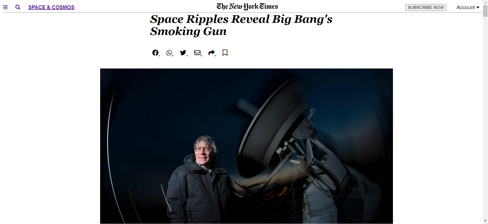

# Day 1: HTML5 and Box model

> Set up a GitHub repository with correct tools

In this exercise, I designed The New York Time Landing Page

## Built With

- HTML
- CSS

## Live Demo

[Live Demo Link](https://livedemo.com)

👤 **Author1**

- GitHub: [@githubhandle](https://github.com/Whoistolu)
- Twitter: [@twitterhandle](https://twitter.com/Littletolu)
- LinkedIn: [LinkedIn](https://www.linkedin.com/in/toluwase-ajise-9b40411b2/)

## 🤝 Contributing

Contributions, issues, and feature requests are welcome!

Feel free to check the [issues page](issues/).

## Show your support

Give a ⭐️ if you like this project!

## Acknowledgments

- Hat tip to anyone whose code was used
- Inspiration
- etc

## 📝 License

This project is [MIT](lic.url) licensed.
